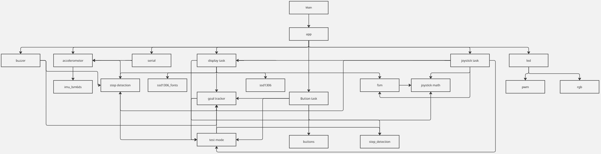
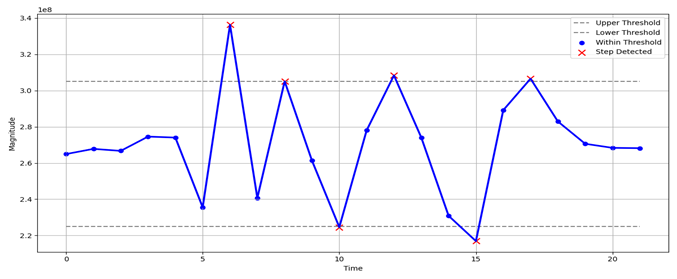

# Introduction
This project implements an embedded step counter using an STM32C071 Nucleo board and a custom expansion module. Developed for ENCE361, it features modular, interrupt-driven firmware that captures accelerometer data to estimate steps and distance.  
Users interact with the system via a joystick, rotary potentiometer, and OLED screen to view progress, set goals, and toggle units. LEDs and a buzzer provide feedback, and a test mode enables validation without walking.  
The firmware is organised into periodic tasks, each handling a distinct function—such as filtering, UI navigation, or goal tracking—following clean code principles. This report details the system’s modular structure, firmware behaviour, profiling results, and key design insights.

# Description of overall project
The goal for this project is to design a step counter on the STM32C071 Nucleo board that tracks a user’s steps by physical movement and displays the count on an OLED display. This product can be applicable to users as a health device or a fitness device. To use the step counter, the user must turn on the device by pressing the on button on the board. When the device is turned on, users have to place the device on their hips and start walking. The device increments the step count by 1 for each detected step. The user can set goals from 500 steps all the way to 15,000 using the potentiometer on the side of the device. The user can also see their progress and the distance travelled. Once the user has reached their goal, the board will award the user with a celebratory tone for completion. The user can now set a new goal and repeat the process.

# Justification and description of modularisation 
The firmware is structured into well-defined modules that isolate core features, hardware interactions, and interface logic. Each .c/.h pair implements a specific subsystem, following clean code principles such as single responsibility, minimal coupling, and high cohesion.

The table below categorises all source modules in the project into three groups:

- **Modules Made** – Custom-developed by the team to implement application logic and control features.
- **Modules Provided** – Supplied by the ENCE361 framework or lab resources for interfacing with peripherals and displays.
- **Modules Generated** – Auto-generated by STM32CubeMX to initialise and configure hardware peripherals such as ADC, DMA, and GPIO.

| Modules Made         | Modules Provided       | Modules Generated          |
|----------------------|------------------------|----------------------------|
| accelerometer.c/h    | buttons.c/h            | adc.c/h                    |
| app.c/h              | imu_lsm6ds.c/h         | dma.c/h                    |
| button_task.c/h      | pwm.c/h                | gpio.c/h                   |
| buzzer.c/h           | rgb.c/h                | i2c.c/h                    |
| display_task.c/h     | ssd1306_conf.h         | main.c/h                   |
| fsm.c/h              | ssd1306_fonts.c/h      | spi.c/h                    |
| goal_tracker.c/h     | ssd1306.c/h            | stm32c0xx_hal_conf.h       |
| joystick_math.c/h    |                        | stm32c0xx_it.c/h           |
| joystick_task.c/h    |                        | tim.h                      |
| led.c/h              |                        | usart.h                    |
| serial.c/h           |                        |                            |
| step_detection.c/h   |                        |                            |
| test_mode.c          |                        |                            |

# Modularisation - Dependency Diagram

**Figure 1:** Firmware module dependency diagram for the step counter system.

The modular architecture is visualised in Figure 1, which outlines the dependency relationships between all source modules. Each block represents a .c/.h pair, and arrows indicate functional dependencies. This structure ensures maintainability, reusability, and scalability of the firmware.

## Hardware Interface Modules

**serial.c/h**  
The serial module functions as a debugger of real time raw data of acceleration in the X, Y and Z direction, ADC, and the magnitude of all 3 acceleration directions, using UART when the `serial_toggle` function is on and outputs that data. 

**accelerometer.c/h**  
The accelerometer.c module functions as a handler for raw accelerometer readings of X, Y and Z axes, and filters the raw data for noise. By filtering out the noise it is then able to calculate the magnitude of X, Y and Z using Pythagoras theorem. 

**buzzer.c/h**  
The buzzer module plays a reward tone/sound when the user has reached their step goal using a PWM buzzer. The `buzzer_execute` function checks if the user has reached the step goal by comparing the number of steps the users have taken vs the number of steps the user set as the goal, if true the `buzzer_start` function starts the PWM signals and `buzzer_end` stops the PWM signal. 

**led.c/h**  
The led module functions as visualization for goal progress using three RGB LEDs and one PWM-controlled LED, in increments of 25%, this module is dependent on the current goal percentage. If the progress is under 25% then the duty cycle for DS3 is calculated. When the user is at 50, 75 and 100% on their goal progress, the RGB LEDs switch on. The DS3 brightness updates and PWM restarts every time the function is called.

## Core Logic Modules

**fsm.c/h**  
The fsm functions as a controller of the user interface (UI) to navigate and switch between different states using the joystick in the left or right direction. This module keeps track of the current screen state; it also has an update function to check when the joystick input was called. It has a cooldown function that allows for smooth transitions between states and prevents accidental and rapid movement. 

**goal_tracker.c/h**  
The goal tracker module functions as a manager of the user’s step goal, this module allows the user to set, update and monitor their step. By long pressing the joystick, the user can access the set goal screen and by using the Potentiometer the user can set how many steps they want to achieve from 500 steps to 15000 steps. 

**step_detection.c/h**  
The step detection module determines what a step looks like by creating an upper and lower threshold of the magnitude. Once the magnitude has exceeded the upper threshold of 305,000,000 and the lower threshold of 225,000,000, the step counter will increment the user's steps by 1. To avoid false positives, `steps_task_execute()` will skip the first 500ms.

**test_mode.c/h**  
The test module functions as a debugger for step counts using the joystick's Y direction. The user can manipulate the step count, and the strength of the joystick controls the size of the change. An upward movement on the joystick will increase the step count, while a downward movement will decrease it.

## Input Modules

**button_task.c/h**  
The button task module functions as the hardware handler for physical buttons on the board. It manual increments the steps and only work when it’s not set to ‘set goal’ mode. Up buttons increment steps; down button toggles the serial output if pressed once and toggles test mode when pressed twice. Left and right buttons perform no actions.

**joystick_task.c/h**  
The joystick task module functions as a handler for joystick ADC readings and button press detection. This module detects click durations for entering and exiting goal-setting mode. It detects upward motion in the Y direction to toggle between units. Examples of joystick task toggles include different states with two different UIs. Goal progress has one view showing steps/goal and another showing the percentage of completion. Distance can be viewed in either kilometres or yards.

**joystick_math.c/h**  
The joystick math functions as an interpreter for joystick input values, it converts ADC values to percentages in the x axis (left, right, and rest) and y axis (up, down, and rest). The module also maps potentiometer values based on the minimum and maximum range.

## UI and Display

**display_task.c/h**  
The display task module functions as a manager, of everything displayed on the OLED screen depending on the app's current state. It contains a main loop that refreshes the screen, switches between modes (raw and percentage), and draws different screens and displays e.g. Goal setting and test mode.

## System Scheduler

**app.c/h**  
The app.c module serves as the main scheduler and orchestrator for the ENCE361 step counter firmware. It initializes all core modules—buttons, display, joystick, accelerometer, LEDs, and the finite state machine—and manages their execution using a millisecond timer (`HAL_GetTick()`). Each task runs at a defined frequency (from `app.h`), and the scheduler checks whether it's time to run each task, updating their next execution times accordingly.

At startup, `app_main()` configures initial timings and enters a loop that ensures timely, non-blocking execution of all tasks. As per specification, the system resets its state on startup—steps and distance are set to 0, and the goal is initialized to 1000 steps. This design enables modular, deterministic behaviour without needing an RTOS. By coordinating user inputs, sensor data, and UI updates precisely, `app.c` ensures smooth, real-time system operation.

[⬆ Back to top](#introduction)

# Analysis of Firmware Operation

The firmware operates under a cooperative task scheduler, using `HAL_GetTick()` for millisecond-resolution timing. Each task is assigned a fixed frequency defined in `app.h`, with critical modules (e.g., accelerometer) running at 60 Hz, and lower-priority tasks (e.g., display) at 4 Hz. This enables non-blocking, deterministic task execution without an RTOS.

## Step Detection

Filtered accelerometer magnitude (squared) is compared against two thresholds:

- Upper threshold (305M): counts a step if not currently in `step_detected` state.
- Between threshold (225–305M): Resets the `step_detection` flag.
- Lower threshold (225M): counts a step if not currently in `step_detected` state.

This hysteresis-based approach ensures reliable detection while filtering out jitter and noise. All step increments—whether from physical motion, button press, or test mode—are routed through `increment_stepcount_common()` for consistency and clamping.

As shown in Figure 2, the accelerometer magnitude is compared against predefined upper and lower thresholds to determine whether a valid step has occurred. Any data point outside this range is flagged as a potential step. This method helps to eliminate false positives due to noise and ensures robust detection performance.

## Test Mode

Test mode is activated via a double press of SW2. While active:
- Joystick Up → increments steps.
- Joystick Down → decrements steps.
- Step delta is proportional to joystick displacement and scaled relative to current goal.
- Prevents exceeding the goal or going below zero.

Test mode disables physical step detection and FSM transitions, allowing controlled simulation of system behaviour and edge cases.

## UI Navigation and Goal Setting

The FSM cycles through three screens: Steps, Distance, and Goal Progress, navigated via joystick left/right. Joystick up toggles units (e.g. steps ↔ % goal, km ↔ yards).

From the Goal Progress screen, holding the joystick for one second enters Goal Set mode, where:
- The potentiometer adjusts the goal (500–15,000 steps)
- A long press confirms the new goal.
- A short press cancels changes.

During goal setting, all other inputs are disabled to prevent accidental interaction.
Distance is computed using a fixed stride length of 0.9 m (≈0.984 yd) per step.

## Goal Feedback

Upon goal completion:
- A melody plays via non-blocking buzzer logic.
- LEDs reflect progress (25% per LED; DS3 uses PWM for <25%)
- Test mode enforces goal limits, preventing buzzer retriggering unless the step count first drops below the goal.

## Serial Output

The `serial_task_execute()` function streams live accelerometer data when enabled. This is useful for:
- Threshold tuning
- Profiling performance
- Verifying orientation compensation

It can be toggled via SW2 single press and incurs no performance penalty when disabled.

## Runtime Profiling of Scheduled Tasks

The table below shows the runtime characteristics of each scheduled task in the step counter firmware. It includes the task frequency, number of ticks taken (measured in CPU cycles), time in microseconds, and the total execution time per second.

| Module         | Frequency (Hz) | Ticks Taken | Time (µs) | Time per Second (s) |
|----------------|----------------|-------------|-----------|----------------------|
| Accelerometer  | 60             | 8,254       | 687.8     | 0.041268             |
| Serial         | 4              | 50,432      | 4,203     | 0.016812             |
| Display        | 4              | 29,730      | 2,477.5   | 0.00991              |
| Step Detection | 6              | 868         | 72        | 0.000432             |
| LED            | 4              | 1,283       | 106.9     | 0.0004276            |
| Button Task    | 50             | 408         | 8         | 0.0004               |
| Buzzer         | 50             | 89          | 7.42      | 0.000371             |
| Joystick Task  | 4              | 1,131       | 84.25     | 0.000337             |
| Test Mode      | 4              | 19          | 1.59      | 0.00000636           |

Although the Serial task appears computationally expensive, this cost only applies when serial debugging is enabled. In normal operation, the `serial_task_execute()` function exits early and consumes less than 1 microsecond per second. With debug output disabled, the overall firmware remains highly efficient, with minimal CPU usage and no overloading of system resources.

The timeline graph below visualises how these tasks are distributed across time. Each task is shown occupying periodic time slots, where coloured blocks indicate execution bursts. The system uses a tick-based cooperative scheduler to run tasks without overlap, maintaining consistent performance.

- Accelerometer — high-frequency task (60 Hz), running in short, regular bursts.
- Step Detection — medium-frequency task (6 Hz), periodic step analysis
- Display / Joystick — less frequent (4 Hz), but more continuous screen refresh.
- Test Mode / LED / Buzzer — very short periodic updates.

This layout ensures that time-critical modules like the accelerometer are evenly spread throughout each second, avoiding clashes with other tasks. Less frequent or non-essential tasks, such as display updates and serial output, are spaced out to preserve responsiveness. When serial debugging is disabled, system load remains extremely light, ensuring smooth runtime behaviour even under maximum input activity.

[⬆ Back to top](#introduction)

# Limitations and Future Improvements

During testing, it was found that the step detection algorithm was less reliable for taller individuals—most notably Freddie—whose walking style differed from our initial test subjects. In some cases, the filtered accelerometer magnitude failed to exceed the upper threshold, resulting in undercounted steps.

This issue likely arose from:
- Different vertical displacement patterns in Freddie’s stride
- Lower impact or different angular acceleration profiles
- Possibly walking posture or limb length causing smoother acceleration curves

## How This Could Be Improved

- **Broader User Testing**: Expanding our test group to include a wider range of heights, walking styles, and step cadences would help tune the thresholds more universally.
- **Adaptive Thresholds**: Implementing a short calibration phase (e.g., walking for 10 seconds) to personalise detection thresholds per user could improve accuracy.

By addressing this limitation, the system would become more inclusive, reliable, and accurate across diverse users—making it more suitable for real-world deployment.

# Conclusions

The ENCE361 step counter project successfully demonstrates a modular, interrupt-driven embedded system capable of real-time step tracking, distance estimation, and user interaction through an intuitive interface. By leveraging a clean task scheduler and well-structured modules, the firmware maintains responsiveness and clarity across a range of features, including goal setting, display navigation, and test mode simulation.

The design adheres to clean code principles, with clearly defined module responsibilities, consistent abstraction, and minimal cross-dependency. Runtime profiling confirms that the system operates efficiently, with all tasks completing well within real-time constraints.

While testing revealed some limitations in the generalisability of step detection, the proposed improvements—such as adaptive thresholds—highlight a clear path for future refinement. Overall, the project met all functional and user interface specifications, offering a strong foundation for further development or deployment in real-world fitness applications.

[⬆ Back to top](#introduction)

# 👥 Authors

This project was developed for ENCE361 at the University of Canterbury by:
- **George Johnson** ([@gjo77](mailto:gjo77@uclive.ac.nz))
- **Emmy Aziz** ([@eaz11](mailto:eaz11@uclive.ac.nz))
